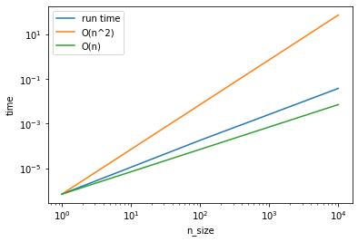
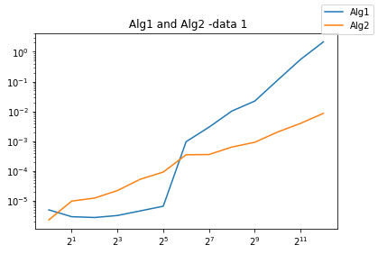
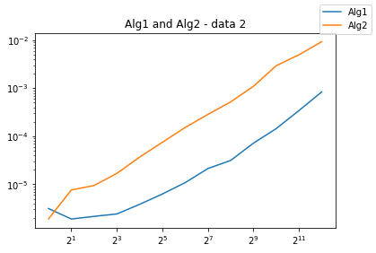
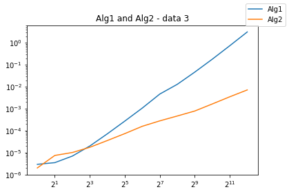

# Assignment 2

##Exercise 1.  
```
with open('weights.txt') as f:
    weights = []
    for line in f:
        weights.append(float(line))
print("average =", sum(weights) / len(weights))
```
1. What went wrong? - MemmoryError
When you call.append() on an existing list, the method adds a new item to the list's end, or right side. As a result, the array expands and expands. As a result, because Python requires additional memory to describe the data structure, float takes 24 bytes, and 500 million float takes 1.2 * 10^10 bytes in total. So, RAM is 8GB, which is 8.6 * 10^9 bytes (1GB = 10243 bytes), and total memory usage (1.2 * 10^10 bytes) is greater than RAM (8.6 * 10^9 bytes), resulting in a MemmoryError.
2. Suggest a way of sorting all the data in the memory 
One of the ways that the data could be sorted is by using Numpy to store all the data in memory which may save some extra memory. Also, instead of using a list to store the data, we could use an array that is built into Numpty ```numpy.array```, that way the data is stored in a contiguous block of memory, which allows for a data buffer, a contiguous (and fixed) block of memory containing fixed-sized data items. Futhermore, a hash function and hash table could be used. Thus, the duplicate values are not going to take up additional space and would be stored in a standardized format.
3. Suggestion for calculating the average that would not require storing all the data in memory
Instead of a list, variable sum could be used to store all of the data, and variable count could be used to count the number of data, where for each loop, each line of data is added to a variable sum, and the count is increased by one. Similarly, Welford's method, which is an online algorithm that computes both the mean and variance by looking at each data point only once and using O(1) memory, could be used.

##Exercise 2. 


##Exercise 3.
For each time, the ```add ``` function is used to insert a single value into the tree: Add value to the root if root is None, then ff the root value is less than the value to be added, the value is added to the correct branch of the tree. Otherwise, value is added to the tree's left side.

Then a function was created to print the list in a form of a list that is based on the  ```list.append(tree.value)``` and dependeing on if statement of the ```tree.left``` and ```tree.right``` 

```
print(printTree(my_tree, list=[]))
[55, 37, 14, 17, 49, 62, 71]
```
Then using the ``` __contains__ ``` method that allow you to use the in operator; e.g. after this change shows that 55 in my_tree should be True in the above example, whereas 42 in my_tree would be False.

```
my_tree.__contains__(55)
True
my_tree.__contains__(42)
False
```

Using various sizes n of trees (populated with random data) and sufficiently many calls to in (each individual call should be very fast, so you may have to run many repeated tests), demonstrate that in is executing in O(log n) times; on a log-log plot, for sufficiently large n, the graph of time required for checking if a number is in the tree as a function of n should be almost horizontal

So, looking at the plot the in is executing in O(log n) times is shown by 
```
test_time = []
n_sample = 1000
repeat = 100
```
and runing thorught a for loop that creayes the range depending on the repeat variable. Futhermore, by using the ```random.randint()``` which is a unbuild function of the random module. That allows us to generate random numbers. 

>O(log n)
.png)

This speed is not free. Provide supporting evidence that the time to setup the tree is O(n log n) by timing it for various sized ns and showing that the runtime lies between a curve that is O(n) and one that is O(n**2)

Then so to see the O(n) and one that is O(n**2) we could draw two graphs that would show the runtime, which means that the time should lie between two given curves. So, then if the sequence is random (random enought), the tree should. 

>O(n)
.png)

>O(n**2)
.png)

We can see that the time required to build up the tree for large tree sizes is between that of an algorithm with complexity O(n) and that of an algorithm with complexity O(n2), indicating that the complexity of the tree setup is O(nlogn)
>Tree Comparison 



##Exercise 4.
By looking at the algorithms and the test that are provided below. They both take lists of numbers and return a list of numbers. In particular, for the same input, they return the same output; that is, they solve the same data processing problem but they do it in very different ways. So the hypothesis for each of the algh are: 

Algorithm 1:  bubble sort, runs through the list entirely before making changes, which would only happen if the list would be sorted. Then, the algorithm compares each item in the list to one another item and if one item is smaller than another, the algorithm would change the order of the list.

Algorithm 2:  restrictive algorithm, mergesort, split the list into units of one element, where it compares each element with the list to sort and merge.

```
test_list = [55, 62, 37, 49, 71, 14, 17]
print(alg1(test_list))
print(alg2(test_list))
[14, 17, 37, 49, 55, 62, 71]
[14, 17, 37, 49, 55, 62, 71]
```
Tests: 
1. Data 1 
```
data1_data = pd.DataFrame(measure_dat1)
data1_data
```
>Data 1

The graph shows more of a flat line that indicates are stronger correlation/relationship between the two alg.

2. Data 2 
```
data2_data = pd.DataFrame(measure_dat2)
data2_data
```
>Data 2


3. Data 3
```
data3_data = pd.DataFrame(measure_dat3)
data3_data
```
>Data 3


By looking at the test data results it could be noted that for the test with data 1 and data 3, alg1 had a faster performance time in comparison to the alg2. So I would recommend using the scaling performance in data 3, as visible on the graph lines the process runs in more of a straight line and it reaches the higher tree size faster. 

Multiprocessing

Using  ```multiprocessing.Pool()```  to parallelize the two independent tasks, as the built-in package that allows the system to run multiple processes simultaneously. It will enable the breaking of applications into smaller threads that can run independently. Furthermore, by parallelizing  alg2 it allows us to perform parallel tasks that are split into subtasks that are assigned to multiple working directories and then completed simultaneously. So, the independent tasks whose results can be combined are based on the executable units which are left and right piles ( that are combined later). 