# Assignment 4

#Exercise 1.  

1. Implement a two-dimensional version of the gradient descent algorithm to find optimal choices of a and b. 
- By using the function ```grad_descent_2D```, we create a loop that allows having stopping criteria. That is based on the value of gradient and/or iterations. Furthermore, since we can't compute derivatives due to the unknown details for the error function, we could build the model based on the derivative definition of f'(x) = f(x + h) - f(x)/h to approximate the gradient

```
def grad_descent_2D(unit_est, gamma, h, threshold):
    prevent_est = unit_est - 10 * threshold
    est = unit_est
    
    est_a = []
    est_b = []
    f_result = []
    iter = 0
    max_value = 10000
    # breaks the loop when min & max values are met
    while norm(est - prevent_est) > threshold and iter < max_value:
        prevent_est = est
        # f(a,b) decreases 
        est = est - gamma * df_grad(est[0], est[1], h)
        est_a.append(est[0])
        est_b.append(est[1])
        f_result.append(f(est[0], est[1]))
        iter = iter + 1
        
    print (f"Minimum value {f_result[-1]} when  a = {est_a[-1]}, b = {est_b[-1]}.")
    
  ```  


- Without knowing the exact function, we know the changing trend between parameters and loss, and we can calculate the gradient by calculating the derivative of loss and parameters (a, b). Loss decreases faster in the opposite direction of the gradient.
- As a stopping condition, we used "'while norm"' when it is less than the threshold, which was set to 1e-8, and when the loop reaches the maximum value of 5000 iterations. Furthermore, based on slide 12, we set the small increment h/delta to 1e-4, which is small enough to be included in the derivative formula.


2. Find both locations (i.e. a, b values) querying the API as needed and identify which corresponds to which. 
  ``` 
#test function
delta = 1e-4
learning_rate = 0.1 #common learning rate are 0.01, 0.0001, 0.05, 0.1
a = 0.4
b = 0.8
#local min
grad_descent_2D(np.array([a, b]), learning_rate, delta, 1e-8)
#global min
grad_descent_2D(np.array([b, a]), learning_rate, delta, 1e-8)
  ``` 
Local: Minimum value 1.100000005 when  a = 0.21595004000034523, b = 0.6889499999996656.
Global: Minimum value 1.000000015 when  a = 0.7119499999995498, b = 0.16894999999976756.

If we don't know how many minimums there were, we'd try different values  (0.999,0.001),(0.001,0.999),(0.999,0.999), and (0.5,0.5) of extreme values of a and b to find local and global minimums, while the values of the other parameters remained the same. Plus, it should be noted that the smallest value represents the global minimum, while the others represent the local minimum.


#Exercise 2.  

- From looking at the cheet sheet and at the slide 13, I removed the normalization since we need to look for the accuracy. Thus, we added the Haversine function from https://stackoverflow.com/questions/4913349/haversine-formula-in-python-bearing-and-distance-between-two-gps-points

- We run the k =5, k =7, and k=15, each for 3 times to see the difference, using basemap (using information from: https://matplotlib.org/basemap/users/robin.html)

K = 5
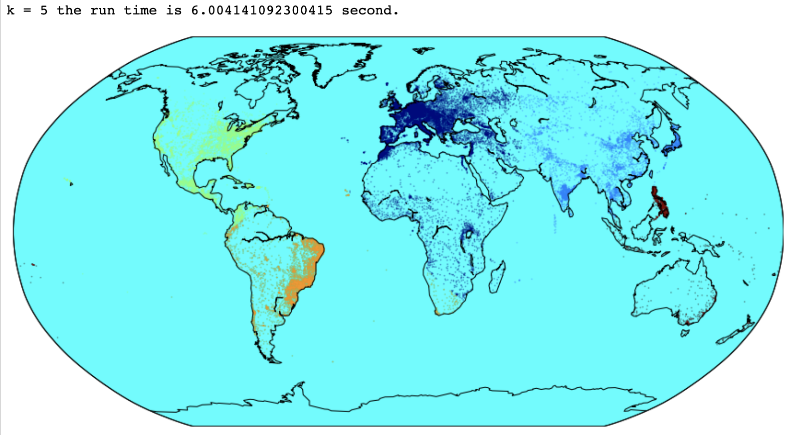
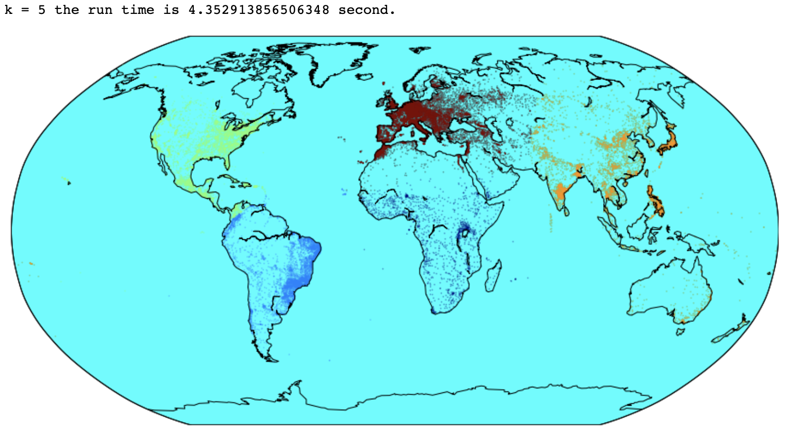
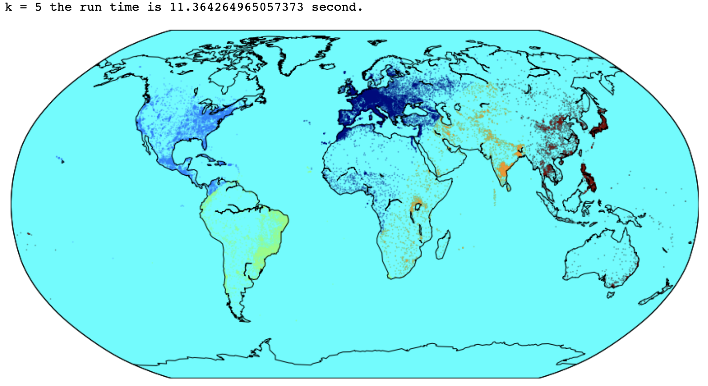

By looking at the maps, it could be noted that there is some cluster diffrence/change when it comes to Europe and Asian parts. Futhermore, there are some chnages that could be seen in parts of South  and North America.

K = 7
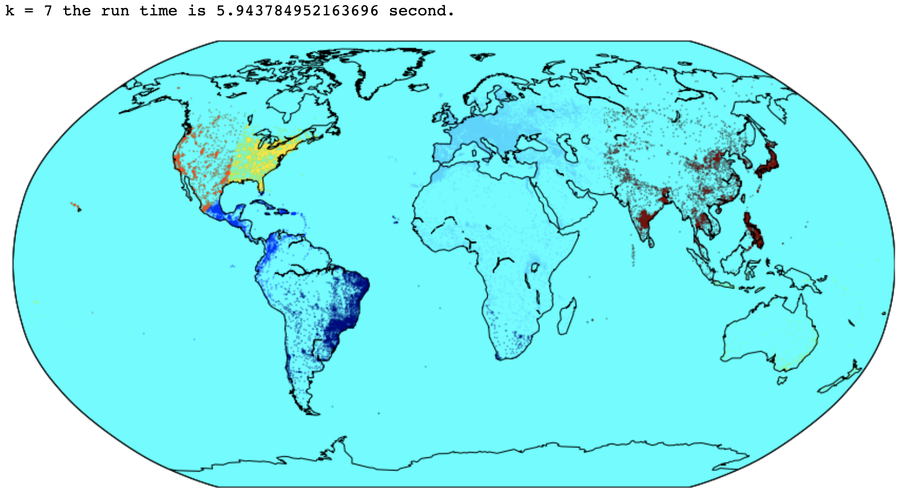
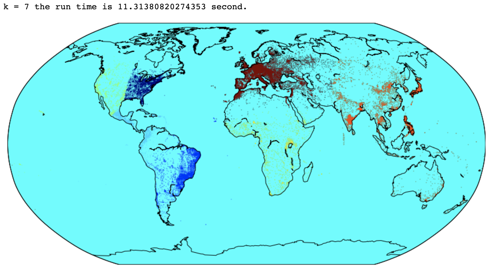
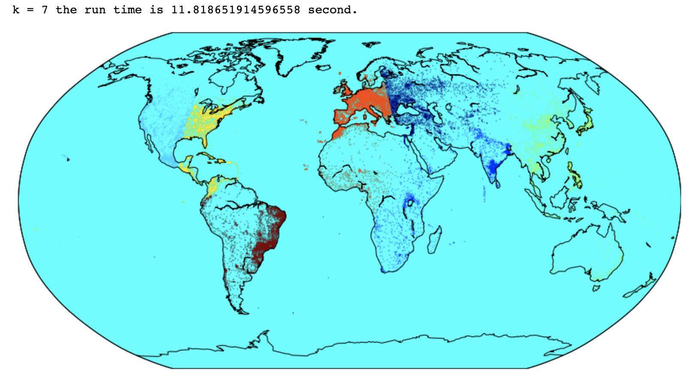

By looking at the maps, it could be noted that there is some cluster diffrence/change when it comes to Europe and North America.

K = 15
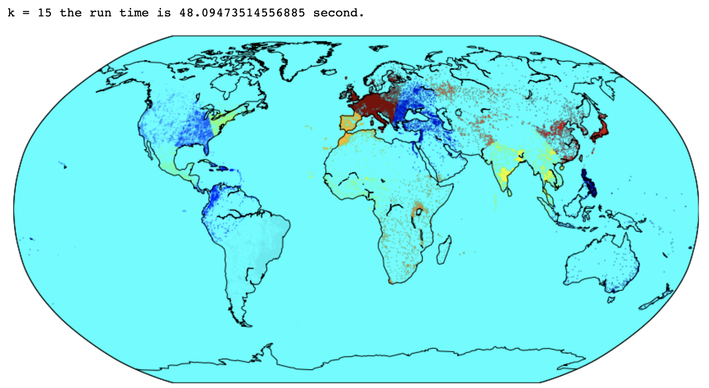
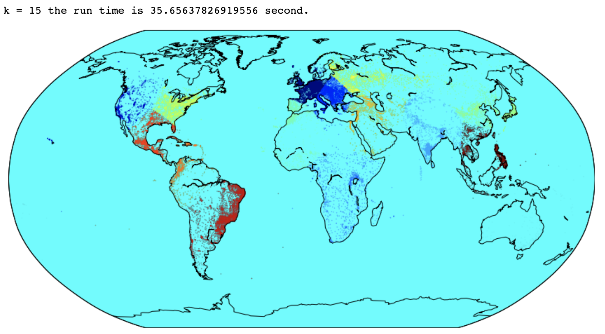
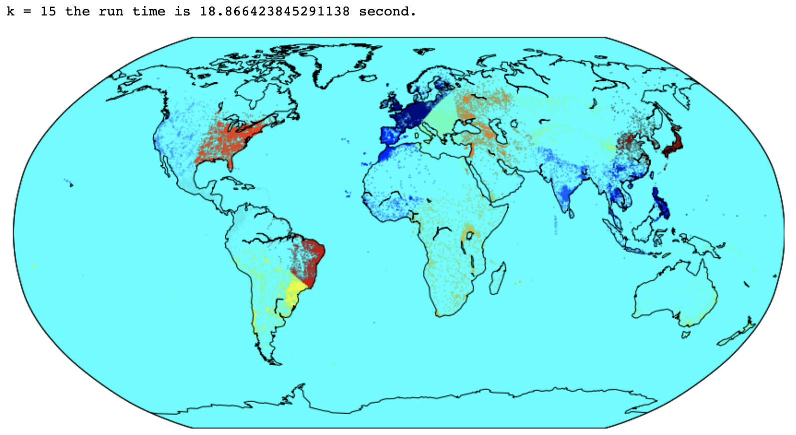

By looking at the maps, it could be noted that there is some cluster diffrence/change when it comes  North America, South America, Africa and parts of Australia (islands around it) and Asia. 

#Exercise 3.  

Not much of code was changed but the ```time.time``` function was added for the end for the timeit of the functions 
``` 
def fibonacci(n):
    # precodition: n an integer >= 1
    if n == 1 or n == 2:
        return 1
    return fibonacci(n-1) + fibonacci(n-2)
``` 
``` 
# test function
print("n = 10, should be 55:", fibonacci(10))
``` 
> n = 10, should be 55: 55
```
from functools import lru_cache

@lru_cache()
def fibonacci_lru(n):
    # preconditions: n an integer >= 1
    if n in (1, 2):
        return 1
    return r(n - 1) + r(n - 2)
```
``` 
# test function
print("n = 10, should be 55:", fibonacci_lru(10))
``` 
> n = 10, should be 55: 55

Fibonacci function: 
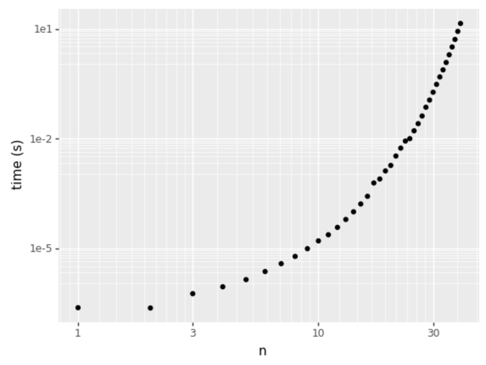
Fibonacci lru function: 
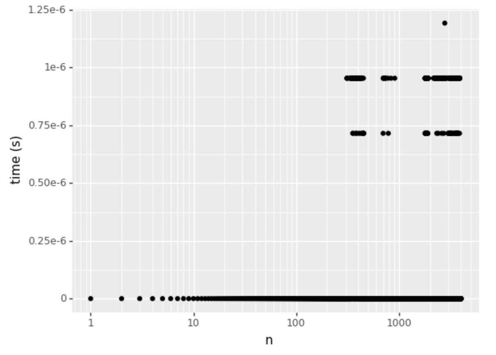
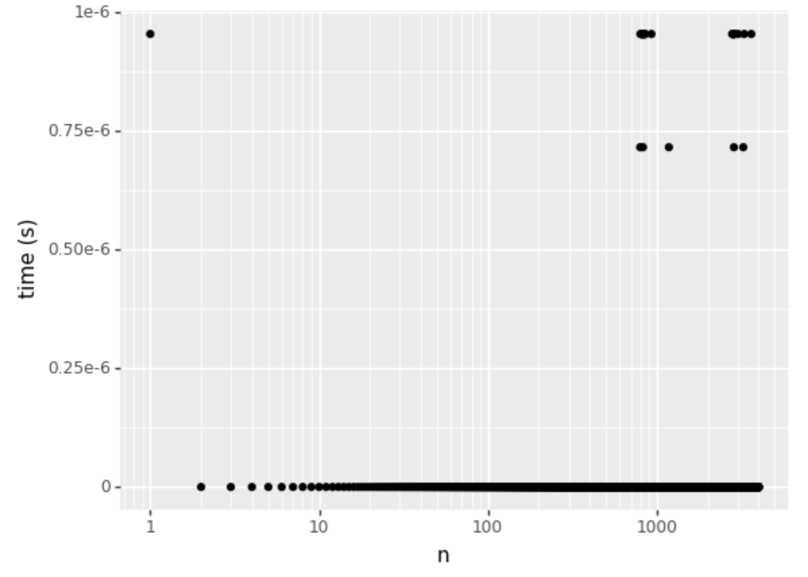

The graphs were set using x-axis as n, and y-axis as time. Thus, it helps to display the time it took each function, plus using log10 s helped to scale the graphs for better visualization.

1.  ```fibonacci``` function time = 2.87s/it
2. ```fibonacci_lru``` function time =  291963.68it/s

When we use ```lru_cache``` in the ```fibonacci_lru``` function, we can see from the graph that the time it takes is close to 0. It should be noted that there are some outliers for ```fibonacci_lru``` graph but they could be ignored for the purpose of the question as they seem to be small and clustered in one area of the graph. 

As a result, we can conclude that ```lru_cache``` is significantly more efficient. The reason that using ```lru_cache``` is more efficient is that there are memory items that are typically added once and never used again, and items that are frequently added and used. ```lru_cache``` is much more likely to remember frequently used items.


#Exercise 4.  
Taking the code from the dot diagram slide and adding an ```if/else``` statement that looks for grid squares that may have been filled in due to gaps in previous enumerations, the ```if/else``` statement keeps the larger number, which looks for horizontal gap situations because ```seq1``` and ```seq2``` are compared to one another. Furthermore, the maximum match length is combined to determine the match cost. Finally, the ```matrix grid``` function searches for current values for each grid square and scans them diagonally and horizontally for values and gaps.

   ``` 
# dot diagram code from slides + https://tiefenauer.github.io/blog/smith-waterman/
def matrix_grid(seq1, seq2, match_score, mismatch, gap_cost):
    # initialize grid
    matrix = np.zeros((len(seq1) +1, len(seq2)+1),int) #np.int
   
    # store max score and coordinates
    max_score = 0
    max_i = 0
    max_j = 0
    
    for i, base1 in enumerate(seq1): 
        for j, base2 in enumerate(seq2):
            if base1 == base2:
                
                if i > 0 and j > 1:
                     matrix[i,j] = max( matrix[i,j],matrix[i-1,j-1] + match_score,matrix[i-1, j-2]+match_score-gap_cost)
                elif i > 0 and j > 0:
                     matrix[i,j] = max( matrix[i,j],matrix[i-1,j-1] + match_score)
                else: 
                     matrix[i,j] = match_score 
            # if vertical gap
            elif i < len(seq1)-1:
                if seq1[i+1] == base2:
                    if i > 0 and j > 0:
                         matrix[i+1,j] = max( matrix[i+1,j],matrix[i-1,j-1]+match_score-gap_cost)
                    else:
                         matrix[i+1,j] += match_score-gap_cost 
            # if mismatch 
            else:  matrix[i,j] = max(0,matrix[i,j] - mismatch) 
            
            # update
            if  matrix[i,j] > max_score:
                max_score =  matrix[i,j]
                max_i = i
                max_j = j 
``` 
Then, matching sequences were created to show the longest matching alignment within the sequence grid

```
# matching sequences +https://biopython.org/docs/1.75/api/Bio.Align.html
    match_seq1 = ""
    match_seq2 = "" 
    max_iteration = 0
    if max_score % match_score == 0: max_iteration = max_score/match_score 
    else: max_iteration = max_score//match_score + 1

    for i in range(int(max_iteration)): 
      # match
      if seq1[max_i] == seq2[max_j]: 
        match_seq1 += seq1[max_i]
        match_seq2 += seq2[max_j]
      # horitzontal gap 
      elif seq1[max_i] == seq2[max_j-1]:
        match_seq1 += "-" + seq1[max_i]
        match_seq2 += seq2[max_j] + seq2[max_j-1] 
        max_j -= 1
      # vertical gap 
      elif seq1[max_i-1] == seq2[max_j]:
        match_seq1 += seq1[max_i] + seq1[max_i-1]
        match_seq2 += "-" + seq2[max_j] 
        max_i -= 1
      max_i -= 1
      max_j -= 1 
```

Sequence: seq1 ="ACTAGACCTAGCATCGAC", seq2 = "TGCATCGAGACCCTACGTGAC"

1. match = mismatch = gap_cost = 1
- Match score = 7
- Match sequences: 
 sequence 1 = GCATCGA 
 sequence 2 = GCATCGA
 The score showed to be equal to 7, which is correct because because there is a gap and lenght of the sequence is 8 ```len(seq1) +1```& score = 7*1(match). 
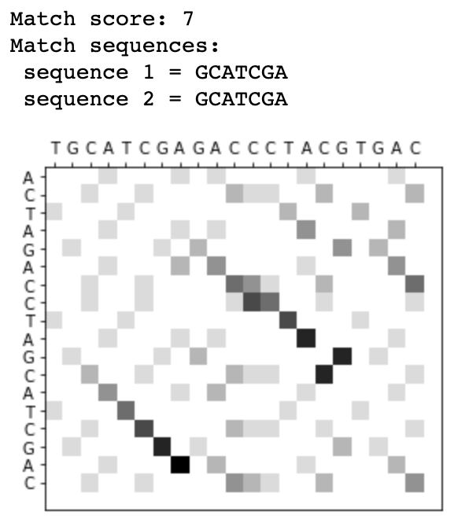
>Note: https://vlab.amrita.edu/?sub=3&brch=274&sim=1433&cnt=1

2. match =  1, mismatch = 1, gap_cost = 2
- Match score: 7
- Match sequences: 
 sequence 1 = GCATCGA 
 sequence 2 = GCATCGA
 Then, with gap cost = 2, the match score was 7 and, according to the scoring rule, match score = 7*1(match), which also aligned to the given score.
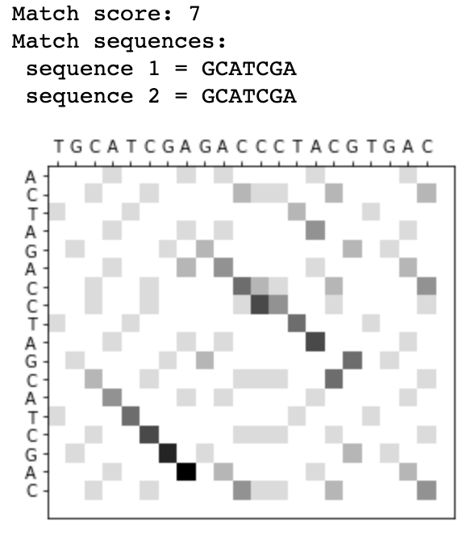

3. match =  2, mismatch = 2, gap_cost = 2
- Match score: 14
- Match sequences: 
 sequence 1 = GCATCGA 
 sequence 2 = GCATCGA
Then, all of the 3 parameters were matched to be eqaul 2.
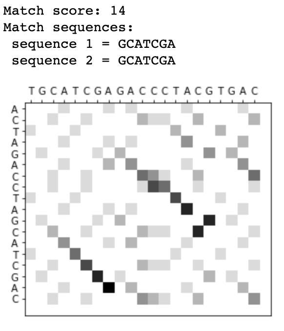

Extra sequence was tested to compare how match = mismatch = gap_cost play a role in the sequence
Sequence: seq1 = "GCGTGCCTAAGGTATGCAAG", seq2 = "ACGTGCCTAGGTACGCAAG"
1. match = mismatch = gap_cost = 1
- Match score: 11
- Match sequences: 
 sequence 1 = GTGCCTAAGGTA 
 sequence 2 = GTGCCT-AGGTA
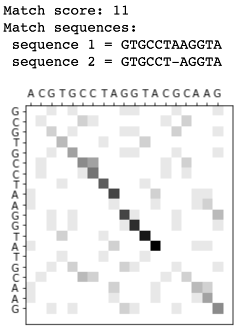

2. match =  1, mismatch = 1, gap_cost = 2
- Match score: 10
- Match sequences: 
 sequence 1 = TGCCTAAGGTA 
 sequence 2 = TGCCT-AGGTA
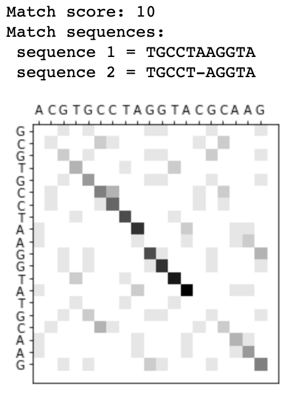