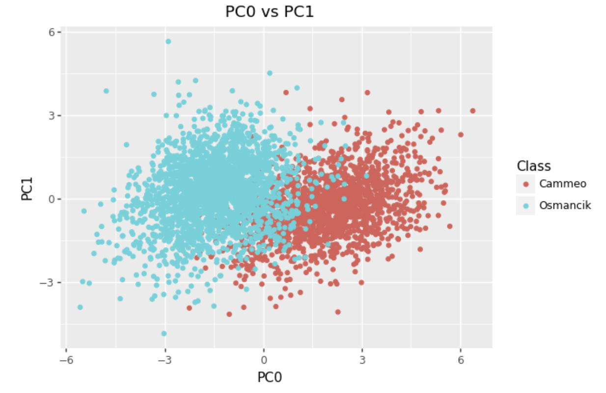

# Assignment 5

#Exercise 1.  
1. Normalize the seven quantitative columns to a mean of 0 and standard deviation 1
```
# normalize the seven quantitative columns to a mean of 0 and standard deviation 1.
for column in data[['Area',
    'Perimeter',
    'Major_Axis_Length',
    'Minor_Axis_Length',
    'Eccentricity',
    'Convex_Area',
    'Extent']]:
    data[column] = (data[column] - np.mean(data[column])) / np.std(data[column])
```
Check data["CLASS"]: 
```
data.value_counts('Class')
Class
Osmancik    2180
Cammeo      1630
dtype: int64
```

1. Scatterplot for PC0 vs PC1 (color-coded by type of rice):
In order to to do a scatterplot for PC0 vs PC1 (color-coded by type of rice), we first took the seven columns and saved into list my_cols
```
# save into list column_name
my_cols = data.columns.values.tolist()
my_cols.pop()
```
Then the data was reduced into the two dimensions using the PCA from sklearn and the code provided for this hw: 
```
#https://scikit-learn.org/stable/modules/generated/sklearn.decomposition.PCA.html
pca = decomposition.PCA(n_components=2)
data_reduced = pca.fit_transform(data[my_cols])
pc0 = data_reduced[:, 0]
pc1 = data_reduced[:, 1]
```
And finally it was graphed the PCA (using a scatterplot graph): 
```
#PC0 vs PC1
(p9.ggplot(data = data_pc0_pc1_list, mapping = p9.aes(x='PC0', y='PC1'))
+ p9.geom_point(p9.aes(x = 'PC0', y = 'PC1', color = 'Class'))
+ p9.labs(title = "PC0 vs PC1"))
```


The scatterplot shows that the PCA method of data classification is not entirely effective because some of the data points that are classified as "Cammeo" or "Osmancik" overlapped. However,, the PCA was able to classif/reduce data into a two dimension succesfuly, and showed the distance between two samples seens to be small if the were to belong into the same class. 


2. Interpretation of what the confusion matrix results mean
In order to interpretation of what the confusion matrix results mean we first needed to create a k-nearest neighbors and QuadTree: 
First, in order to set up data with points and create a quad tree, the first class Point was used. Each point holds the data x, y, and class. The width and height of the quadtree, in which (x, y) is the rectangle's center point and wid, hgt are the region's half-width and height, were saved using the class rectangle. To determine whether the rectangle is inside the circle, whose center is at point.x, point.y, the function within() was created.

```
#https://jrtechs.net/data-science/implementing-a-quadtree-in-python
#https://scipython.com/blog/quadtrees-2-implementation-in-python/
#quadtree0.py code from class 
class Point: #the points in the training set
    def __init__(self, x, y, payload=None):
        self.x, self.y = x, y
        self.payload = payload

    def distance_to(self, other):
        try:
            other_x, other_y = other.x, other.y
        except AttributeError:
            other_x, other_y = other
        return np.hypot(self.x - other_x, self.y - other_y)

class Rect: #Rectangular store the shape and other attribute of the quadtree
    #cx: center point x-axis
    #cy: center point y-axis
    #w: the width of the rectangular
    #h: the height of the rectangular
    def __init__(self, cx, cy, w, h):
        self.cx, self.cy = cx, cy
        self.w, self.h = w, h
        self.west_edge, self.east_edge = cx - w/2, cx + w/2
        self.north_edge, self.south_edge = cy - h/2, cy + h/2

    def contains(self, point): 
        try:
            point_x, point_y = point.x, point.y
        except AttributeError:
            point_x, point_y = point

        return (point_x >= self.west_edge and
                point_x <  self.east_edge and
                point_y >= self.north_edge and
                point_y < self.south_edge)

    def intersects(self, other):
        return not (other.west_edge > self.east_edge or
                    other.east_edge < self.west_edge or
                    other.north_edge > self.south_edge or
                    other.south_edge < self.north_edge)
```
```
import math
class newQuadTree:
    def __init__(self, points, bounds, max_points=4):
        self.bounds = bounds
        self.max_points = max_points
        self._points=points
        self.x0=bounds[0]
        self.x1=bounds[1]
        self.y0=bounds[2]
        self.y1=bounds[3]
        if len(points)>max_points:
            self.divide()
            self._points=None
        else:
            self._points=points
            self.children=[]
            
    def divide(self): #divide the quad tree into 4 sub quadtree 
        self.children=[]
        xmid=(self.x0+self.x1)/2
        ymid=(self.y0+self.y1)/2
        newBounds=[[self.x0, xmid,self.y0,ymid],[self.x0,xmid,ymid,self.y1],
                   [xmid,self.x1,self.y0,ymid],[xmid,self.x1,ymid,self.y1]]
        for newBound in newBounds:
            self.children.append(newQuadTree(filter_range(self._points, newBound),newBound,self.max_points))


    def size(self):
        if not self.children:
            return len(self.points)
        else:
            total=0;
            for child in self.children:
                total+=child.size()
            return total
    
    def get_within_radius(self, center, radius, found_points):
        #check for overlap
        if  ((center[0]+radius<=self.x0 or center[0]-radius>=self.x1) or
                (center[1]+radius<=self.y0 or center[1]-radius>=self.y1)):
            return []
        # see if the values are within boundary
        if not self._points:
          for child in self.children:
            child.get_within_radius(center,radius,found_points)
        else:
          for point in self._points:
            if (math.sqrt(pow((point[0]-center[0]),2)+pow((point[1]-center[1]),2))<=radius):
              found_points.append(point)
        return found_points


def filter_range(points, bounds):
    x,y,cond=zip(*points)
    return [[x[i],y[i],cond[i]] for i in range(len(x)) if bounds[0]<=x[i]<=bounds[1] and bounds[2]<=y[i]<=bounds[3]]
```           


Then the function KNN(), where the  quad tree was saved: 
```
#https://www.fatalerrors.org/a/k-nearest-neighbor-query-based-on-k-dimension-tree-of-knn-algorithm.html
#https://machinelearningmastery.com/tutorial-to-implement-k-nearest-neighbors-in-python-from-scratch/
#https://stackabuse.com/k-nearest-neighbors-algorithm-in-python-and-scikit-learn/
class KNN2D(): 
    def __init__(self, k = 1) -> None:
        self.k = k

    def fit(self, data, conds):
        x,y=zip(*data)
        points=[[_x[0],_x[1],_cond] for _x,_cond in zip(data,conds)]
        # points=[[x[i],y[i],conds[i]] for i in range(len(conds))]
        # print("creating quad tree")
        self.qtree=newQuadTree(points,[min(x),max(x),min(y),max(y)])
  
    
    def predict(self, X):
        k = self.k
        conds = []
        # binary search for radius
        r_max = 3
        r_min = 0
        while True:
            found_points = []
            r = (r_max + r_min) / 2
            # print("getting radius", X, r, found_points)
            self.qtree.get_within_radius((X[0], X[1]), r, found_points)
            # print("got radius")
            if len(found_points) > k:
                r_max = r
            elif len(found_points) < k:
                r_min = r
            elif ((r_max-r_min)<0.01):
                break
            else:
                break
        for p in found_points:
            conds.append(p[2])
        return np.bincount(conds).argmax()

```
- k = 1 
```
# k=1

for i in range(0, len(X), int(len(X)/3)):
    i = int(i)
    x_test = X.iloc[i: i+int(len(X)/3)]
    x_train = X.drop(x_test.index)
    y_test = Y[x_test.index]
    y_train = Y.drop(x_test.index)

    knn = KNN2D(k=1)
    pca=decomposition.PCA(n_components=2)
    pca_x_train=pca.fit_transform(x_train)
    pca_x_test=pca.transform(x_test)
    knn.fit(pca_x_train, y_train)
    pred=[]
    for x_val in pca_x_test:
      pred.append(knn.predict(x_val))
    pred = np.array(pred)
    y_test = np.array(y_test)
    print("Matrix of k = 1 nearest neighbors:")
    print(confusion_matrix(y_test, pred))

```
Matrix of k = 1 nearest neighbors:
[[661  83]
 [ 84 442]]
Matrix of k = 1 nearest neighbors:
[[635  80]
 [ 69 486]]
Matrix of k = 1 nearest neighbors:
[[651  70]
 [ 61 488]]

- k = 5 

```
 # k=5
for i in range(0, len(X), int(len(X)/3)):
    i = int(i)
    x_test = X.iloc[i: i+int(len(X)/3)]
    x_train = X.drop(x_test.index)
    y_test = Y[x_test.index]
    y_train = Y.drop(x_test.index)

    knn = KNN2D(k=5)
    pca=decomposition.PCA(n_components=2)
    pca_x_train=pca.fit_transform(x_train)
    pca_x_test=pca.transform(x_test)
    knn.fit(pca_x_train, y_train)
    pred=[]
    for x_val in pca_x_test:
      pred.append(knn.predict(x_val))
    pred = np.array(pred)
    y_test = np.array(y_test)
    print("Matrix of k = 5 nearest neighbors:")
    print(confusion_matrix(y_test, pred))

```

Matrix of k = 5 nearest neighbors:
[[681  63]
 [ 63 463]]
Matrix of k = 5 nearest neighbors:
[[668  47]
 [ 60 495]]
Matrix of k = 5 nearest neighbors:
[[669  52]
 [ 48 501]]

In contrast, the overall false positive (Osmancik is incorrectly classified as Cammeo) and false negative (Cammeo is incorrectly classified as Osmancik) is lower in the results when k = 5 than in the results when k = 1. It is obvious that the overall true positive (Osmancik is correctly classified as Osmancik) and true negative (Cammeo is correctly classified as Cammeo) is higher in the results when k = 5 than k = 1. As a result, we can colnclude that k=5 is better.


#Exercise 2.  

1. What's your data?
The online data set I chose is the Life Expectancy(WHO), which consists of data from the period 2000 to 2015 for 193 countries. World Health Organization (WHO) keeps track of the health status as well as many other related factors for all countries. The datasets are made available to the public for health data analysis. The dataset related to life expectancy, and health factors for 193 countries during 2000-2015, has been collected from the same WHO data repository website and its corresponding economic data was collected from the United Nation website. Among all categories of health-related factors, only those critical factors were chosen which are more representative. It has been observed that there have been improvements in human mortality rates, especially in developing nations. Thus, I decided to look into further how some of the factors/variables play a role in developing and developed countries when it comes to health aspects and economic one. 
As the datasets were from WHO, we found no evident errors. Missing data were handled by filling null values with the means. The result indicated that most of the missing data were for population, Hepatitis B, and GDP. The data consists of 22 Columns and 2938 rows. 

2. What analyses do you want to run and why are they interesting? 
First, I would like to start with a set of descriptive analyses to demonstrate the dataset and then move into showing the correlations and sitrubution of variables. And lastly, I would like to run a PCA test as well as maybe the K-nearest neighbor to demonstrate the variable predictivity of a life expectancy in developing vs developed counties. 

3. Which ones will be interactive, where the user can provide a parameter?
I am planning to have an interactive PCA and hopefully a worls map to show the parameters of life expectancy in each presented county as well as a set of interactive graphs based on each variable of the life expectancy dataset to show the parameters and how they play a role in each country presents. And finally I am hoping to implemnet a interactive describptive analysis dashboard using ```pandas-profiling``` library. 

4. What graphs will you make?
  - Linear plots for each specific variable 
  - Histograph to show distribution of life expectancy 
  - World map 
  _ Correlation matrix 
However, it should be noted that most of the graphs that will be presented are going to be line graphs that indicate either growth or decline of life expectancy given a specific variable. 

5. Describe how you want your website to work.
For the website, I am thinking of implementing the ```pandas-profiling``` library and setting it as a dashboard page on the first main page (if not just a basic descriptive analysis page telling a bit more about the data). Then, there would be different tabs for each parameter and/or the interactive graph ( they might be included in either a separate tab or within the parameters).

6. What do you see as your biggest challenge to completing this, and how do you expect to overcome this challenge?

One of the first challenges of this assignment was finding the dataset and then coming up with the right set of analyses to do for it. And the second challenge that I think is the biggest one is setting up a webpage for the interactive data visualizations as well as the descriptive analysis. 

I am planning on overcoming those challenges by using the resources given to me through class lectures as well as resources found online. Furthermore, I belive that the resources shared, and the hands-on experience that we get in class regarding the flask and parametric test that we have done so far for homework assignments would be great resources to use to overcome the challenges. 

#Exercise 3.  

1. Perform any necessary data cleaning
> Original data citation: https://statecancerprofiles.cancer.gov/incidencerates/index.php?stateFIPS=00&areatype=state&cancer=001&race=00&sex=0&age=001&stage=999&year=0&type=incd&sortVariableName=rate&sortOrder=default&output=0#results

```
#https://moonbooks.org/Articles/How-to-remove-one-or-multiple-rows-in-a-pandas-DataFrame-in-python-/
# https://stackoverflow.com/questions/13682044/remove-unwanted-parts-from-strings-in-a-column/22238380

# remove rows that don't contain data 
data = data.drop(data.index[53:74])

# remove the number and brackets in the Stats
data['State'] = data['State'].map(lambda x: x[:-3])

# rename column for numbers taken form States 
data = data.rename(columns = {" FIPS": "FIPS"})

# edit the new column FIPS 
#https://www.digitalocean.com/community/tutorials/update-rows-and-columns-python-pandas
#https://stackoverflow.com/questions/12604909/pandas-how-to-change-all-the-values-of-a-column
data['FIPS'] = (data['FIPS']/1000).map("{:,.0f}".format)

# save the clean data into a CSV file 
data.to_csv('clean_data.csv', index=False)

clean_data = pd.read_csv("clean_data.csv")
clean_data
```
For the flaks part, I have run in inot a few problems when trying to run the code

>An exception has occurred, use %tb to see the full traceback.SystemExit: 1
>Address already in use. Port 5000 is in use by another program.

```
import pandas as pd
from flask import Flask, render_template, request
from collections import Counter

df = pd.read_csv("/Users/polina/Desktop/clean_data.csv")

state_name_list = df["State"].to_list()
rate_list = df["Age-Adjusted Incidence Rate([rate note]) - cases per 100,000"].to_list()


app = Flask(__name__)


@app.route("/")
def index():
    return render_template("index.html")


@app.route("/info", methods=["GET"])
def analyze():
    usertext = request.args.get["usertext"]
    if usertext in state_name_list[1:]:
        i = state_name_list.index(usertext)
        rate = str(rate_list[i])
    else:
        rate = "Input a State"
    return render_template("analyze.html", output = rate, usertext=usertext)

@app.route("/state/<string:name>")
def state_search(name):
    i = state_name_list.index(name)
    rate = rate_list[i]
    state_search = "State: <u>" + name + "</u>. Age-Adjusted Incidence rate (cases per 100k) of <u>" + str(rate) + "</u>"
    return state_search


if __name__ == "__main__":
    app.run(debug=True)
```


