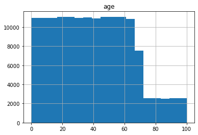
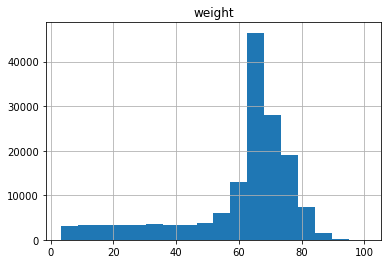
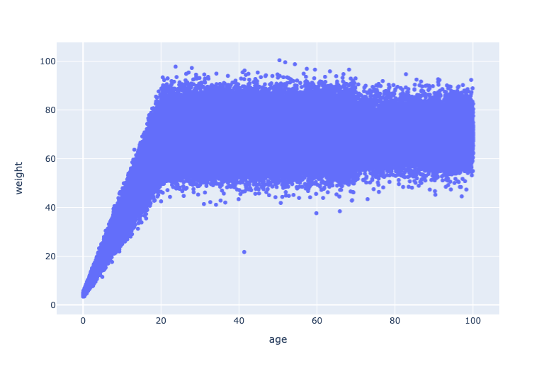
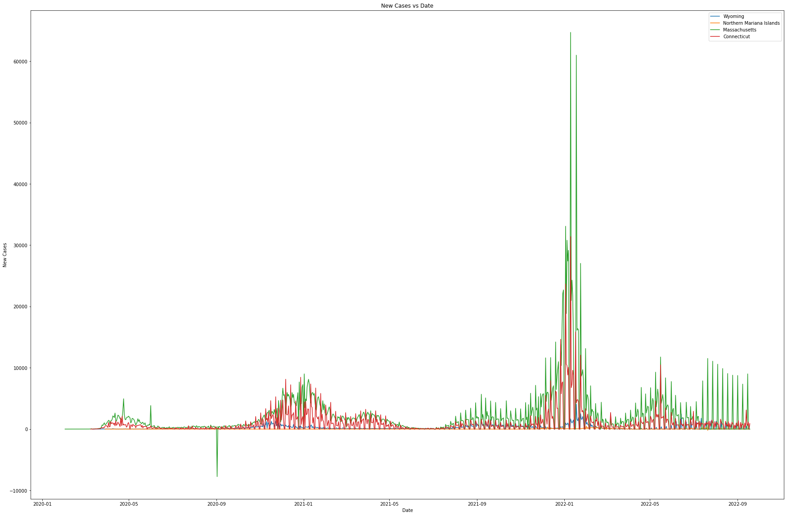

# Assignment 1 

##Exercise 1.  
- Code explanation: by using an inner function - range_temp_function(x), the temp_tester  checks the temperature in the range +/-1 degree of either a human or chicken temperature. Furthermore, the inner function allows us to print the result as either True for not having a fever or False to indicate the temperature is either too low or too high.
- Testing: for the testing purpose the human temperature was set to 37, and the chicken's was 41.1. The code below shows  the testing process 
```
#Tesing code:
human_tester = temp_tester(37)
chicken_tester = temp_tester(41.1)

chicken_tester(42)
human_tester(42)
chicken_tester(43)
human_tester(35)
human_tester(98.6)
```

##Exercise 2. 

>The dataset cointains are 4 columns and 152361 rows. Thus there 152,361 people in the pupulation with columns names 
1. name
2. age
3. weight
4. eyecolor

#Age

- Mean = 39.510528
- Standard Deviation = 24.152760
- Minimum = 0.000748
- Maximum = 99.991547

> Function data. describe() a variable was used to find out the statistical description of the varaible.

>Each bin is plotted as a bar whose height corresponds to how many data points are in that bin. Thus, we could use Sturges' Rule to calculate the optimal number of bins to use in a histigram: 

>Optima Bins = [log<sub>2</sub>(n) + 1]
```
log2 = math.log2(152361)+1  
log2
```
> Thus, showing that the optima number of bins would be 18. 


>Furthermore, from the graph, it could be noted that the distribution is somewhat not normal and skewed to the right. Plus, it could be noted that there are extrim drops in age counts when it comes to 60 and then an extreme jump dowm to 80. And it could be noted that the graph was constructed using data.hist function that allows to build of histograms depending on the variables. 

#Weight 

- Mean = 60.884134
- Standard Deviation = 18.411824
- Minimum = 3.382084
- Maximum = 100.435793
> Function data. describe() a variable was used to find out the statistical description of the varaible.



> The graph indicates a skewed to the left side histogram, as most of the values are on the right side of the graph. Thus, indicating that there are fewer people that weight then 60. Furthermore, an extreme drop coudl be noted around 70-pound weight, and some of the outliers are located near a 100 and a 0. And it could be noted that the graph was constructed using data.hist function that allows to build of histograms depending on the variables. 



> The scatter plot has a positive correlation to zero correlation as the graph indicates to have both a vertical and horizon line. Thus, age and weight have somewhat of a weak relationship and are closer to not having a relationship with each other at all. To build the scatter plot ```import plotly.express as px ``` was used to onstruct  a scatter plot graph. 


> Outlier: 
- count: 537
- name: Anthony Freeman
- age: 41.3
- weight: 21.7

> The outlier was found using the plotly histogram that allows you to hover on the scatter plot dots and see their exact x and y values, thus by looking at the outlier on the closer to the bottom of the graph, his x and y values were given. Then, to print his name and excat patient id, a print function was used containing the  exact values for the age and weight that were noted by hovering over the outlier. Futhermore, to make sure for sure about outliers another filter was set to print the names of patients whose age is more than 20, and weights either less then 40 or more than a 100. 


##Exercise 3
This data was taken [GitHub Pages](github.com/nytimes/covid-19-data).
License:
https://github.com/nytimes/covid-19-data

To create the graphs first we had to convert the 'Date' column to DateTime format using the pandas to_datetime function. Then, the function to plot states new cases vs date. Creating a new dataset df_new, that stores the new cases allows us to use the function .diff(), which finds the first discrete difference of objects over the given cases. Then, the new dataset set is graphed using dates as the x-values, and cases as the y-values. Plus, to make sure it was readable different colors are assigned automatically to each state when graphed. 

> Testing the graph:
```
# Example to test plot function
state_list = ['Wyoming', 'Northern Mariana Islands', 'Massachusetts','Connecticut']
plot(state_list)
```


To create a function that takes the name of a state and returns the date of its highest number of new cases, we used a similar method as the one used for creating plots in the above example. We used to define new data and new variables that contain values for a maximum number of cases using the max() function. Furthermore, to insure that we only got one date for the maximum number of cases for each state a date.iloc[0] was used. 

>Testing the function: 
```
print(highest_case('Washington'))
print(highest_case('Illinois'))
print(highest_case('Massachusetts'))

2022-01-18 00:00:00
2022-01-18 00:00:00
2022-01-10 00:00:00
```
Following the method used in the prior example above a similar function was created using the highest_case function from above to calculate which state has the highest number of new cases when compared. Furthermore, the if and else statement was used to print which state has the highest number of daily new cases by a number of days, which were calculated using the abs() function and looking at the difference between two dates (of two different states).

>Testing the function: 
```
peak('Massachusetts', 'Connecticut')
peak('Florida', 'Washington')
peak('California','Connecticut')

Massachusetts and Connecticut had its highest number of daily new cases on 2022-01-10 
Florida had its highest number of daily new cases by 14 days
Ohio had its highest number of daily new cases by 9 days
```

##Exercise 4
```
import xml.etree.ElementTree as ET
tree = ET.parse('/Users/polina/Desktop/desc2022.xml')
root = tree.getroot()
```
